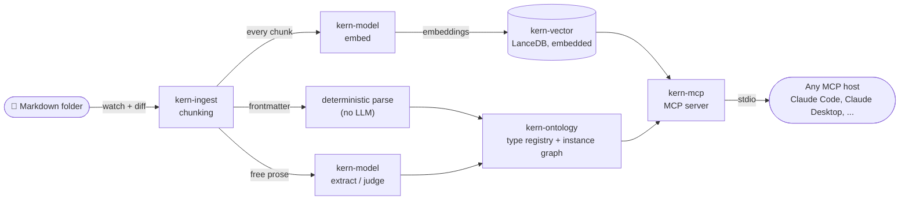

<p align="center">
  
</p>

<p align="center">
<a href="https://github.com/rafaelnicolett/kern/actions/workflows/ci.yml"></a>
<a href="#license"></a>
<a href="rust-toolchain.toml"></a>
</p>

**kern** is a local-first RAG engine built for **Spec-Driven Development** —
the Markdown that spec-first workflows and AI coding agents already
produce, full of frontmatter like `id`, `kind`, `depends_on`, `implements`.
That frontmatter already *is* a relationship graph — kern parses it
**deterministically** into real entities and typed relations, no LLM
involved for content that's already structured. A local model only gets
called for free-form prose that has no frontmatter to parse, or for the
rare candidate ambiguous enough to need a judgment call against what the
ontology already knows.

Point kern at that folder, and it keeps a local vector index (an embedded
LanceDB) and that lightweight ontology — entities, typed relations, cited
evidence — in sync as your specs, plans, and tasks change. No external
database, no GPU, no full-corpus rebuild on every edit.

> **Status: pre-v0, under active construction.** The CLI, the MCP contract
> and the ontology schema can still change without notice before v1.
> Issues and feedback are very welcome.

|  | kern | plain vector search | full GraphRAG (Neo4j/Qdrant) |
|---|---|---|---|
| External infra | none | vector database | graph database + vector database |
| GPU | not required | not required | usually recommended |
| Update cost | file diff | file diff | often a full rebuild |
| Relational queries | yes, routed by type | no | yes |

Plain vector search alone still loses relational understanding as a corpus
grows — "what depends on X?" isn't a question embeddings answer well on
their own, which is exactly the gap the frontmatter-driven ontology closes
without needing GraphRAG's external infrastructure.

## Principles

1. **Actually local-first** — no data ever leaves the machine.
2. **No GPU required** — CPU is the reference case, not the exception.
3. **Incremental by default** — reprocessing is triggered by a file diff,
   never a full corpus rebuild.
4. **Agents are the primary consumer** — the main interface is MCP over
   stdio; the CLI exists for operation and debugging, not as the product
   itself.
5. **Static binary, no runtime dependency — for retrieval.** Download the
   `with-embedding-model` tarball and the vector index (embedding +
   search) works with zero external services. This does **not** extend to
   ontology extraction/judging today: that part of the pipeline needs a
   real LLM backend (Ollama), in every tarball variant, no exceptions yet.
   Half the pipeline is genuinely dependency-free; the other half isn't —
   see [Model backend](#model-backend).

## How it works



A single binary watches the folder, chunks and embeds new or changed
content, and keeps the vector index up to date. Frontmatter fields that map
to a known concept (`id`, `kind`, `depends_on`, `implements`, ...) become a
real entity and real relations immediately — no distance computation, no
model call beyond the one-time, cached interpretation of a new frontmatter
shape. Free-form prose (or the ambiguous case even the ontology's own
distance check can't resolve) is what asks a local model to decide: merge
into an existing type, promote to a new one, or discard. See
[`docs/adr`](docs/adr) for the architecture decision history.

### Model backend

kern needs a local model for embeddings (and, optionally, for ontology
extraction/judging) — configured once per project, not guessed at
`serve` time. `kern project create` resolves it as part of creation:

- **Interactively** (a terminal, no provider flags) — a guided setup
  wizard detects what's available locally (an `Ollama` `/api/tags` probe,
  listing your pulled models with their reported capabilities — never
  guessed from the model name — plus the bundled engine if a `.gguf` is
  cached) and lets you pick.
- **Non-interactively** — pass `--embedding-provider <ollama|llama_cpp_embedded>
  --embedding-model <name>` (and optionally `--extraction-provider ollama
  --extraction-model <name>`) directly; required when stdin isn't a
  terminal, so scripted/CI usage never hangs waiting for input that can't
  arrive.

Either way, kern proves the provider works — an embedding call, dimension
included — **before** persisting anything to `.kern/config.toml`. Two
local engines are supported today:

- **Ollama** — `ollama pull all-minilm` for embeddings, and optionally
  `ollama pull llama3.2` for ontology extraction/judging.
- **Bundled engine** — release binaries embed a
  [llama.cpp](https://github.com/ggml-org/llama.cpp) `llama-server`,
  extracted to `~/.cache/kern/bin/` on first use, no separate install. The
  embedding *weights* still have to come from somewhere:
  - the **[`kern-<target>-with-embedding-model`](#zero-setup-embeddings-no-ollama)
    release tarball** ships an embedding model
    ([`all-MiniLM-L6-v2`](https://huggingface.co/sentence-transformers/all-MiniLM-L6-v2),
    F16 GGUF, ~46 MB, Apache-2.0 — see
    [NOTICE-THIRD-PARTY](NOTICE-THIRD-PARTY)) as a file next to the binary,
    adopted into `~/.cache/kern/models/` the first time it's needed — no
    manual step.
  - the plain `kern-<target>` tarball doesn't include a model file — either
    run Ollama, or place a compatible embedding `.gguf` under
    `~/.cache/kern/models/` by hand.

This still only closes the zero-setup gap for **embeddings**: the bundled
engine has no extraction/judging backend, so that path needs Ollama
regardless of which tarball you use. There's also still no *runtime*
automatic download from Hugging Face — the with-embedding-model tarball is
a build-time bundling choice, not download-on-demand.

Once configured, the choice is pinned — `kern serve` never silently swaps
providers or falls back if the configured one becomes unreachable (a
deliberate change from earlier v0 behavior), and switching a project's
embedding model to a different dimension requires an explicit
re-index (`kern config set-embedding` fails clearly rather than corrupting
the existing index). See `kern config show|set-embedding|set-extraction
--project <name>` to inspect or change an existing project's
configuration.

Whatever the source, chunk sizing itself adapts to the configured
provider's reported context window — never a hardcoded assumption
about how much text any given backend can accept in one call.

### Indexing throughput

`kern serve`'s catch-up scan embeds and enriches chunks concurrently, not
one at a time — bounded by two separate knobs, one inside kern's own
config, one on the model backend it's talking to. Both are real,
measured levers, not guesses:

- **`[indexing] chunk_concurrency`** in `.kern/config.toml` — how many
  chunks kern has in flight at once during indexing. Defaults to `8`,
  written explicitly into a new project's config file so it's visible and
  hand-editable:

  ```toml
  [indexing]
  chunk_concurrency = 8
  ```

  Change it by editing that number directly (no `kern config set-*`
  subcommand for this one — it's a plain integer, not something that
  needs a capability probe the way switching a model does) and re-running
  `kern serve`. `kern config show --project <name>` prints the value
  currently in effect.

- **`OLLAMA_NUM_PARALLEL`** — outside kern entirely, this is Ollama's own
  setting for how many requests its backing `llama-server` actually
  processes in parallel per model. It defaults to a low value, and
  raising `chunk_concurrency` above does **nothing** on its own if this is
  still capping the backend to one request at a time underneath — kern's
  concurrency only overlaps *waiting*, it can't make a serial backend
  faster. Confirmed directly from the running process during development:
  with the default, `llama-server` was launched with `-np 1`; setting the
  env var and restarting Ollama changed that to `-np 4`.

  To change it (macOS, Ollama installed as the menu-bar app):

  ```bash
  launchctl setenv OLLAMA_NUM_PARALLEL 4
  killall Ollama    # fully quit — a respawned background service alone
                     # keeps the OLD environment, has to be the app itself
  open -a Ollama
  ```

  On Linux (`ollama serve` run directly, or via systemd), set the env var
  before starting it instead — e.g. `OLLAMA_NUM_PARALLEL=4 ollama serve`,
  or add `Environment="OLLAMA_NUM_PARALLEL=4"` to the systemd unit.
  Verify the change actually took by checking the backing process's own
  arguments (`ps aux | grep llama-server`) for `-np <N>` — `launchctl
  setenv`/the env var alone doesn't confirm anything landed.

  **More is not automatically better.** On the machine this was measured
  on, going from `OLLAMA_NUM_PARALLEL=4` to `8` made real indexing
  *slower*, not faster — `llama-server`'s own arguments showed it had
  fallen back to `--no-mmap` under the extra memory pressure of 8 parallel
  contexts. `4` was the measured sweet spot on that hardware; yours may
  differ. Measure before committing to a value, the same way this project
  did — don't just set it to a high number and assume it helped.

  This setting is not currently exposed for the bundled `llama-server`
  path (`llama_cpp_embedded`) — `LlamaCppRuntime::spawn` doesn't pass
  `-np` today, so that backend runs effectively serial regardless of
  `chunk_concurrency`. A known gap, not yet closed.

## Installing

### From a release (recommended)

Pre-built binaries are published on the
[Releases page](https://github.com/rafaelnicolett/kern/releases) for
macOS (Apple Silicon and Intel) and Linux (x86_64):

```bash
# macOS, Apple Silicon
curl -L https://github.com/rafaelnicolett/kern/releases/latest/download/kern-aarch64-apple-darwin.tar.gz | tar xz

# macOS, Intel
curl -L https://github.com/rafaelnicolett/kern/releases/latest/download/kern-x86_64-apple-darwin.tar.gz | tar xz

# Linux, x86_64
curl -L https://github.com/rafaelnicolett/kern/releases/latest/download/kern-x86_64-unknown-linux-gnu.tar.gz | tar xz
```

Then move the extracted `kern` binary onto your `PATH`, e.g.:

```bash
mv kern/kern /usr/local/bin/
```

> Linux arm64 and Windows aren't built yet — see [Contributing](#contributing)
> if you'd like to help close that gap.

### Zero-setup embeddings (no Ollama)

`kern-<target>-with-embedding-model.tar.gz` bundles an embedding model
alongside the binary — no Ollama, no manual `.gguf` placement:

```bash
curl -L https://github.com/rafaelnicolett/kern/releases/latest/download/kern-aarch64-apple-darwin-with-embedding-model.tar.gz | tar xz
```

(same pattern for `x86_64-apple-darwin` and `x86_64-unknown-linux-gnu`)

**Run it once from the extracted folder before moving the binary anywhere.**
kern looks for a `.gguf` sitting next to its own executable the first time
it needs the embedded backend, and adopts it into `~/.cache/kern/models/`:

```bash
cd kern-aarch64-apple-darwin-with-embedding-model
./kern project create acme --path ./docs/acme \
  --embedding-provider llama_cpp_embedded \
  --embedding-model all-MiniLM-L6-v2-ggml-model-f16.gguf
./kern serve --project acme
```

After that first run, the model is cached and the binary can be moved onto
`PATH` like the plain tarball above (`mv kern /usr/local/bin/`) — a
symlink created *before* that first run does **not** work as a shortcut
around this (verified: `current_exe()` returns the invoked path, not the
symlink's target, so a pre-placed symlink can't see the sidecar file
either). Moving the binary away before the first run strands the model
file behind and `kern serve` fails with a clear
`AGENT_SURFACE.MODEL_MISSING_FROM_CACHE` error rather than a confusing one.

This still doesn't cover ontology extraction/judging — that needs Ollama
either way (see [Model backend](#model-backend)).

### From source

Requires the Rust toolchain pinned in
[`rust-toolchain.toml`](rust-toolchain.toml) — `rustup` installs it
automatically:

```bash
git clone https://github.com/rafaelnicolett/kern.git
cd kern
cargo build --release -p kern-cli
# binary at target/release/kern
```

## Quick start

`kern project create` resolves your model provider as part of creating the
project — see [Model backend](#model-backend). Interactively, in a
terminal:

```bash
# 1. Create a project — an isolated index + ontology over one folder.
# With no --embedding-provider/--embedding-model flags and a TTY,
# this launches a guided setup wizard.
kern project create acme --path ./docs/acme

# 2. Serve it: catches up on any backlog, then exposes MCP over stdio
kern serve --project acme

# 3. From another terminal, check on it
kern status --project acme
```

Non-interactively (scripts, CI — required when stdin isn't a terminal,
kern fails fast rather than hanging on input that can't arrive):

```bash
kern project create acme --path ./docs/acme \
  --embedding-provider ollama --embedding-model all-minilm \
  --extraction-provider ollama --extraction-model llama3.2   # optional
```

`kern serve` blocks, speaking MCP JSON-RPC over stdio — it's meant to be
launched by an MCP host, not run interactively in a terminal you're typing
into. See below for wiring it up.

**v0 target**: install-to-useful-`query_ontological`-response should take
about 2 minutes. For the **embedding** path, that's met today by the
[`kern-<target>-with-embedding-model`](#zero-setup-embeddings-no-ollama)
release tarball (see [BENCHMARKS.md](BENCHMARKS.md#3-time-to-useful-response)
for a measurement) — no manual `ollama pull` or `.gguf` placement
needed, just picking it in the wizard (or passing
`--embedding-provider llama_cpp_embedded --embedding-model <the .gguf
file's name>`). **Ontology extraction/judging** still needs Ollama
regardless of tarball; that half of the v0 target isn't met yet.

### Connecting an MCP host

**Claude Code:**

```bash
claude mcp add kern -- kern serve --project acme
```

**Claude Desktop** (`claude_desktop_config.json`):

```json
{
  "mcpServers": {
    "kern": {
      "command": "kern",
      "args": ["serve", "--project", "acme"]
    }
  }
}
```

Any other MCP-compatible host works the same way: point it at the `kern`
binary with `serve --project <name>` as arguments.

## MCP tools

| Tool | What it does |
|---|---|
| `search_hybrid` | Vector similarity search over indexed chunks, boosted by keyword match |
| `query_by_concept` | Look up an entity by name and its direct relations |
| `get_related_entities` | Walk the instance graph outward from an entity, up to a given depth |
| `get_ontology_schema` | List the current entity and relation type vocabulary |
| `explain_relation` | Return the evidence path behind a specific relation |
| `query_ontological` | The main entry point — routes semantically between the vector index and the ontology, whichever answers the question better |

See
[`docs/architecture/mcp-tool-contract.md`](docs/architecture/mcp-tool-contract.md)
for the full contract.

## Examples

[`examples/`](examples) has a full, step-by-step tutorial, not just a
corpus. [`examples/sample-specs/`](examples/sample-specs) is a 15-file
Spec-Driven Development project with **3 related features** and
cross-feature dependencies (a scheduled-reports feature that
`depends_on` two other features' specs), plus free-form prose files with
no frontmatter at all.

```bash
kern project create demo --path examples/sample-specs \
  --embedding-provider ollama --embedding-model all-minilm \
  --extraction-provider ollama --extraction-model llama3.2
python3 examples/call_tool.py target/release/kern demo \
  query_by_concept '{"concept": "TASK-006"}'
```

An unedited result from that corpus — two hops of `get_related_entities`
from one task surfaces its entire cross-feature dependency web, none of
which is visible from reading that one task file alone:

```
> get_related_entities({"entity_id": "<TASK-006's id>", "depth": 2})

{
  "subgraph": {
    "entities": [
      { "canonical_name": "TASK-004", ... }, { "canonical_name": "TASK-005", ... },
      { "canonical_name": "PLAN-003", ... }, { "canonical_name": "PLAN-001", ... },
      { "canonical_name": "PLAN-002", ... }, { "canonical_name": "SPEC-003", ... },
      { "canonical_name": "TASK-001", ... }
    ]
  }
}
```

**[Read the full tutorial →](examples/README.md)** — every one of kern's 6
MCP tools, with transcripts, plus a limitation this bigger corpus
surfaced that a 5-file toy example didn't: `query_ontological`'s semantic
routing gets less reliable once several files have structurally-similar
content, and [`examples/skills/spec-context/`](examples/skills/spec-context)
is a droppable Claude Code skill built around that finding — using the
more precise `query_by_concept` → `get_related_entities` flow instead of
the router alone.

## v0 scope

1. Markdown-aware ingestion, chunking, and local vector indexing (embedded
   LanceDB, embedding via a local subprocess).
2. An incremental ontology engine with three outcomes per candidate
   (merge / new type / judge), with a fallback-rate metric exposed via
   structured logs and traces (`tracing` crate — not yet wired to an
   OpenTelemetry exporter, see [ADR-0005](docs/adr/0005-observability-from-v0.md)).
3. MCP over stdio, with the six tools above.
4. A minimal CLI: `project create` (with guided or non-interactive
   provider setup), `serve`, `status`, `config show|set-embedding|set-extraction`.

**Deliberately out of scope for v0**: a GUI/desktop app, a local HTTP API,
multi-process/multi-client coordination, and built-in document conversion
(PDF, DOCX, etc. always go through an external, configurable subprocess —
never a library compiled into kern).

## Workspace layout

Hexagonal architecture (ports & adapters), traits-first — see [`docs/adr/`](docs/adr)
for the decision history, in particular [ADR-0001](docs/adr/0001-hexagonal-reference-architecture.md)
(the overall shape), [ADR-0008](docs/adr/0008-pluggable-local-model-providers.md)
(provider capability + selection) and [ADR-0009](docs/adr/0009-per-project-embedding-dimension-pinning.md)
(dimension pinning).

### `kern-ingest` — watching and chunking

- `Watcher`: event-driven folder watching (via `notify`), never polling.
- `is_real_change`: content-hash diff (blake3) — a touch with no real
  content change never triggers reprocessing.
- `StructuralMarkdownChunker`: splits a document at heading boundaries,
  never cutting a code block or table in half.
- `BudgetAwareMarkdownChunker`: a decorator around the above that
  sub-splits any chunk exceeding the active model's real token budget —
  paragraph boundaries first, then sentences, then a hard UTF-8-safe cut
  as the last resort — while still never splitting a code block or table,
  even under budget pressure.
- `TokenCounter` port: how chunk size is estimated is itself pluggable;
  `HeuristicTokenCounter` (chars/4) is the only implementation today, with
  the door left open for a real per-model tokenizer later.

### `kern-vector` — the embedded vector index

- `LanceVectorStore`: a thin wrapper over embedded LanceDB, one directory
  per project (`<project>/.kern/vectors/`) — no external server, no FFI.
- `search_hybrid`: vector similarity search fused with a keyword-match
  boost via Reciprocal Rank Fusion, so an exact-term match can outrank a
  vectorially-closer chunk with no shared term.
- `ensure_table`/`existing_dimension`: table creation is deferred until a
  real embedding dimension is known, and pinned per project — a mismatch
  (switching to a differently-dimensioned model) is a clear error, never a
  silent truncate/rebuild of the existing index.

### `kern-ontology` — the incremental type system

- `TypeRepository`/`InstanceRepository` (SQLite-backed): the entity-type
  registry, relation vocabulary, and instance graph.
- `OntologyEngine`: for each candidate, decides merge into an existing
  type / promote to a new type / ask `judge()` — the fallback path,
  reserved for the genuinely ambiguous middle (see
  [BENCHMARKS.md](BENCHMARKS.md) for the real fallback-rate measurement).
- `process_frontmatter`: deterministic — frontmatter fields that map to a
  known concept (`id`, `kind`, `depends_on`, `implements`, ...) become
  real entities and relations with no model call beyond the one-time,
  cached interpretation of a new frontmatter *shape*.
- `process_chunk`: the free-form prose path — real LLM extraction +
  distance-based classification for content with no frontmatter to parse.

### `kern-model` — the pluggable provider layer

- `EmbeddingProvider`/`ExtractionProvider` ports, each with a concrete
  local adapter: `OllamaClient` (both traits, opportunistic — used only if
  a daemon responds on `:11434`) and `LlamaCppRuntime` (embedding only,
  spawns the bundled `llama-server` subprocess).
- `capabilities()`: real, ground-truth self-description (model id,
  embedding dimension, max input tokens) — always a live round-trip
  against the actual backend, never a static assumption about "the" model.
- `EmbeddingProviderSelection`/`ExtractionProviderKind` +
  `build_embedding_provider`/`build_extraction_provider`: open-ended
  factories `kern-cli`'s composition root uses to build a real provider
  from persisted config — adding a new local engine is one enum variant
  and one factory arm, not a rewrite of the call sites.

### `kern-mcp` — the agent-facing surface

The MCP server (built on `rmcp`), exposing six tools over stdio — see
[MCP tools](#mcp-tools) below and the full contract at
[`docs/architecture/mcp-tool-contract.md`](docs/architecture/mcp-tool-contract.md).

### `kern-cli` — the `kern` binary

- `project create`: creates an isolated project (its own SQLite state +
  vector index) **and** resolves its model provider in the same step — a
  guided terminal wizard when interactive, explicit
  `--embedding-provider`/`--embedding-model` flags otherwise. Never
  persists a configuration that hasn't been proven to work against a real
  round-trip.
- `serve`: catches up on any backlog (chunk, embed, index, enrich), then
  exposes MCP over stdio. Loads the project's pinned provider
  configuration — no runtime auto-fallback if it becomes unreachable.
- `status`: project health from persisted state alone (chunk count, entity
  and relation type counts, the active provider/model/dimension) — works
  even without a `serve` running.
- `config show|set-embedding|set-extraction`: inspect or reconfigure an
  existing project's provider later.
- `embedded`: manages the bundled `llama-server` extraction and the
  `~/.cache/kern/models/` lookup (including sidecar-model adoption from a
  `with-embedding-model` release tarball) that back the
  `llama_cpp_embedded` provider.

## Benchmarks

Real, reproducible, small-corpus numbers (fallback rate, memory/CPU) live
in [`BENCHMARKS.md`](BENCHMARKS.md), with the exact methodology to
reproduce each one — no comparison against other tools is included until
that can be done with a declared, verified configuration on both sides.

## Contributing

Rust, MSRV pinned in [`rust-toolchain.toml`](rust-toolchain.toml).
`cargo test`, `cargo clippy -- -D warnings`, `cargo fmt --check` and
`cargo audit` all run in CI on every push. Issues and PRs are welcome —
Linux arm64 and Windows support for the release build matrix would make a
great first contribution.

## License

Dual-licensed under [MIT](LICENSE-MIT) or [Apache-2.0](LICENSE-APACHE), at
your option — the Rust ecosystem default. The
`kern-<target>-with-embedding-model` release tarball additionally
redistributes a third-party embedding model — see
[NOTICE-THIRD-PARTY](NOTICE-THIRD-PARTY) for license and attribution.

---

<sub>Powered by [Helyx](https://helyx.build).</sub>
