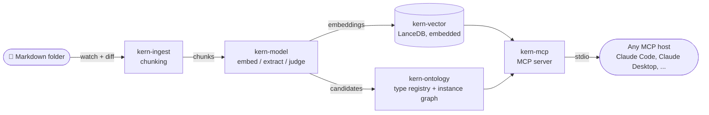

<p align="center">
  
</p>

# kern

[](https://github.com/rafaelnicolett/kern/actions/workflows/ci.yml)
[](#license)
[](rust-toolchain.toml)

**kern** is a local-first RAG engine with an incrementally-built ontology,
exposed to any AI agent over MCP.

Point it at a live folder of Markdown, and it keeps a local vector index
(an embedded LanceDB) and a lightweight ontology — a curated vocabulary of
relation types plus an instance graph — in sync as your files change. No
external database, no GPU, no full-corpus rebuild on every edit.

> **Status: pre-v0, under active construction.** The CLI, the MCP contract
> and the ontology schema can still change without notice before v1.
> Issues and feedback are very welcome.

## Why kern

Plain vector search loses relational understanding as a corpus grows — "what
depends on service X?" isn't a question embeddings answer well. Full
GraphRAG solves that, but usually drags in heavy external infrastructure (a
dedicated graph database, Docker/Kubernetes) and a full corpus rebuild on
every update — a poor fit for fast local iteration.

kern aims for the middle ground: an ontology that grows incrementally, with
zero external infrastructure, on an ordinary CPU.

## Principles

1. **Actually local-first** — no data ever leaves the machine.
2. **No GPU required** — CPU is the reference case, not the exception.
3. **Incremental by default** — reprocessing is triggered by a file diff,
   never a full corpus rebuild.
4. **Agents are the primary consumer** — the main interface is MCP over
   stdio; the CLI exists for operation and debugging, not as the product
   itself.
5. **Static binary, no runtime dependency** — download it, run it.

## How it works



A single binary watches the folder, chunks and embeds new or changed
content, and keeps the vector index up to date. Only when a candidate
entity falls into the ambiguous zone against the existing ontology does it
ask a local model to decide: merge into an existing type, promote to a new
one, or discard. See [`docs/adr`](docs/adr) for the architecture decision
history.

### Model backend

kern needs a local model for embeddings (and, lazily, for ontology
extraction/judging). It resolves one automatically, and never falls back
silently — if nothing usable is found, `kern serve` fails with a clear
error instead of guessing:

- **Ollama, if available** — if a daemon is already responding on
  `:11434`, kern uses it opportunistically. This is the easiest path
  today: `ollama pull all-minilm` for embeddings, and optionally
  `ollama pull llama3.2` for ontology extraction/judging.
- **Bundled engine, otherwise** — release binaries embed a
  [llama.cpp](https://github.com/ggml-org/llama.cpp) `llama-server`,
  extracted to `~/.cache/kern/bin/` on first use, no separate install.
  *Automatic model-weight download is landing soon; until then, place a
  compatible embedding `.gguf` file under `~/.cache/kern/models/`.*

## Installing

### From a release (recommended, once available)

Pre-built binaries are published on the
[Releases page](https://github.com/rafaelnicolett/kern/releases) for
macOS (Apple Silicon and Intel) and Linux (x86_64):

```bash
# macOS, Apple Silicon
curl -L https://github.com/rafaelnicolett/kern/releases/latest/download/kern-aarch64-apple-darwin.tar.gz | tar xz

# macOS, Intel
curl -L https://github.com/rafaelnicolett/kern/releases/latest/download/kern-x86_64-apple-darwin.tar.gz | tar xz

# Linux, x86_64
curl -L https://github.com/rafaelnicolett/kern/releases/latest/download/kern-x86_64-unknown-linux-gnu.tar.gz | tar xz
```

Then move the extracted `kern` binary onto your `PATH`, e.g.:

```bash
mv kern/kern /usr/local/bin/
```

> Linux arm64 and Windows aren't built yet — see [Contributing](#contributing)
> if you'd like to help close that gap.

### From source

Requires the Rust toolchain pinned in
[`rust-toolchain.toml`](rust-toolchain.toml) — `rustup` installs it
automatically:

```bash
git clone https://github.com/rafaelnicolett/kern.git
cd kern
cargo build --release -p kern-cli
# binary at target/release/kern
```

## Quick start

```bash
# 1. Create a project — an isolated index + ontology over one folder
kern project create acme --path ./docs/acme

# 2. Serve it: catches up on any backlog, then exposes MCP over stdio
kern serve --project acme

# 3. From another terminal, check on it
kern status --project acme
```

`kern serve` blocks, speaking MCP JSON-RPC over stdio — it's meant to be
launched by an MCP host, not run interactively in a terminal you're typing
into. See below for wiring it up.

Before the first `serve`, resolve a model backend per the
[Model backend](#model-backend) section above: either `ollama pull
all-minilm` (and optionally `llama3.2`), or a manually cached `.gguf` for
the embedded path — `kern serve` has nothing to fall back on otherwise, and
fails with a clear error rather than hanging.

**v0 target**: once model resolution is fully automatic (no manual `ollama
pull` or manual `.gguf` placement needed), install-to-useful-`query_ontological`-response
should take about 2 minutes, dominated by the one-time model download, not
by setup friction. That's the design target this v0 is built toward — it
isn't there yet (see [Model backend](#model-backend)), so budget a few extra
manual minutes today for pulling or placing a model first.

### Connecting an MCP host

**Claude Code:**

```bash
claude mcp add kern -- kern serve --project acme
```

**Claude Desktop** (`claude_desktop_config.json`):

```json
{
  "mcpServers": {
    "kern": {
      "command": "kern",
      "args": ["serve", "--project", "acme"]
    }
  }
}
```

Any other MCP-compatible host works the same way: point it at the `kern`
binary with `serve --project <name>` as arguments.

## MCP tools

| Tool | What it does |
|---|---|
| `search_hybrid` | Vector similarity search over indexed chunks, boosted by keyword match |
| `query_by_concept` | Look up an entity by name and its direct relations |
| `get_related_entities` | Walk the instance graph outward from an entity, up to a given depth |
| `get_ontology_schema` | List the current entity and relation type vocabulary |
| `explain_relation` | Return the evidence path behind a specific relation |
| `query_ontological` | The main entry point — routes semantically between the vector index and the ontology, whichever answers the question better |

See
[`docs/architecture/mcp-tool-contract.md`](docs/architecture/mcp-tool-contract.md)
for the full contract.

## v0 scope

1. Markdown-aware ingestion, chunking, and local vector indexing (embedded
   LanceDB, embedding via a local subprocess).
2. An incremental ontology engine with three outcomes per candidate
   (merge / new type / judge), with a fallback-rate metric exposed via
   structured logs and traces (`tracing` crate — not yet wired to an
   OpenTelemetry exporter, see [ADR-0005](docs/adr/0005-observability-from-v0.md)).
3. MCP over stdio, with the six tools above.
4. A minimal CLI: `project create`, `serve`, `status`.

**Deliberately out of scope for v0**: a GUI/desktop app, a local HTTP API,
multi-process/multi-client coordination, and built-in document conversion
(PDF, DOCX, etc. always go through an external, configurable subprocess —
never a library compiled into kern).

## Workspace layout

```
kern-ingest/     file watcher + markdown-aware chunking
kern-vector/     wrapper around the embedded LanceDB vector store
kern-ontology/   type registry, relation vocabulary, incremental diff engine
kern-model/      EmbeddingProvider/ExtractionProvider traits, bundled llama-server subprocess, opportunistic Ollama adapter
kern-mcp/        MCP server (rmcp) exposing the agent-facing tools
kern-cli/        the `kern` binary: project create, serve, status
```

Hexagonal architecture (ports & adapters), traits-first — see [`docs/adr/`](docs/adr)
for the decision history.

## Contributing

Rust, MSRV pinned in [`rust-toolchain.toml`](rust-toolchain.toml).
`cargo test`, `cargo clippy -- -D warnings`, `cargo fmt --check` and
`cargo audit` all run in CI on every push. Issues and PRs are welcome —
Linux arm64 and Windows support for the release build matrix would make a
great first contribution.

## License

Dual-licensed under [MIT](LICENSE-MIT) or [Apache-2.0](LICENSE-APACHE), at
your option — the Rust ecosystem default.

---

<sub>Powered by [Helyx](https://helyx.build).</sub>
